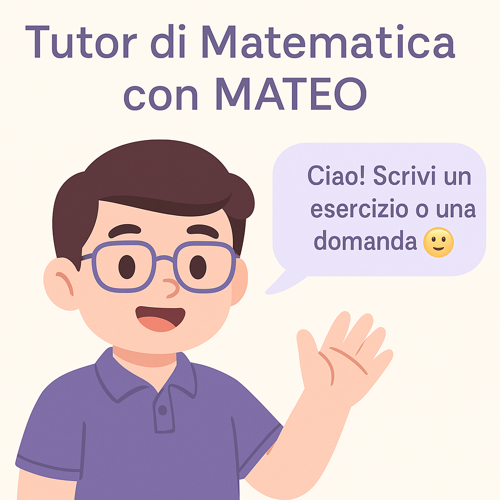
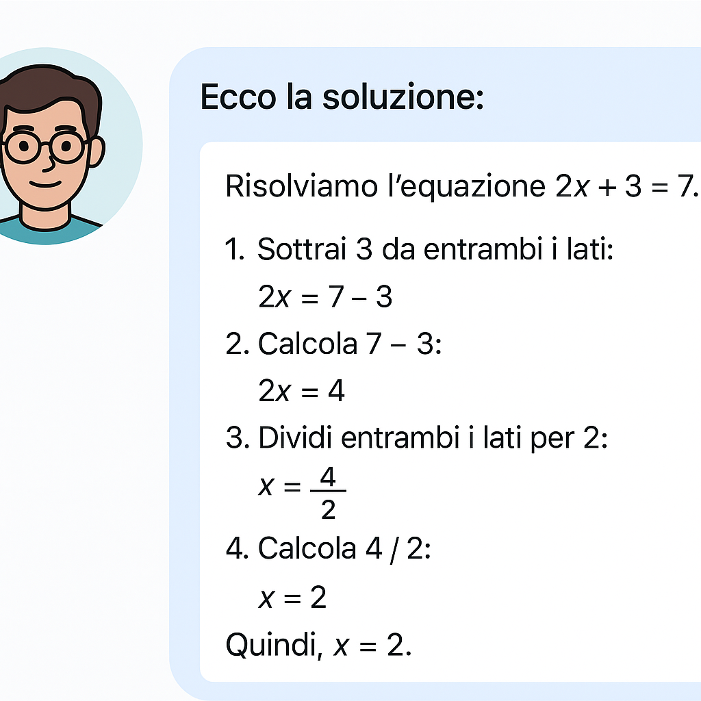

# 🤖 Tutor MATEO AI – Assistente di Matematica Educativo

MATEO è un tutor virtuale basato su **intelligenza artificiale**, pensato per aiutare studenti e studentesse (soprattutto con DSA, discalculia o autismo) a **risolvere problemi di matematica passo dopo passo**, con un linguaggio semplice, visivo e inclusivo.



---

## ✨ Caratteristiche

- ✔️ Risoluzione **guidata** di problemi matematici
- 🧠 Linguaggio accessibile e inclusivo
- 🎨 Interfaccia chiara e simpatica
- 🧩 Supporto per studenti con difficoltà di apprendimento
- 🔄 Comunicazione in tempo reale con il modello LLaMA 3 (via Ollama)

---

## 📦 Requisiti

- Python 3.8 o superiore
- Flask
- Markdown
- [Ollama](https://ollama.com) installato localmente con modello `llama3`

Installa i pacchetti Python:

```bash
pip install flask markdown
🚀 Come avviare il progetto
Avvia il modello AI:

bash
Copia
Modifica
ollama run llama3
Avvia il server Flask:

bash
Copia
Modifica
python app.py
Vai su http://localhost:5000

📷 Anteprime
Schermata iniziale


Esempio di risposta passo dopo passo



🧩 Struttura del progetto


📁 tutor_mateo_ai/
├── app.py               # Backend Flask
├── static/
│   ├── style.css        # CSS
│   ├── front.js         # JS
│   ├── mateo.png        # Avatar
│   ├── demo_mateo.png   # Screenshot 1
│   └── demo_risposta.png# Screenshot 2
├── templates/
│   └── index.html       # Interfaccia web
├── README.md


❤️ Creato con amore
Creato da EvyB con ❤️ per supportare l’apprendimento della matematica 

📄 Licenza
Distribuito sotto licenza MIT – puoi usarlo liberamente per scopi educativi o personali.


